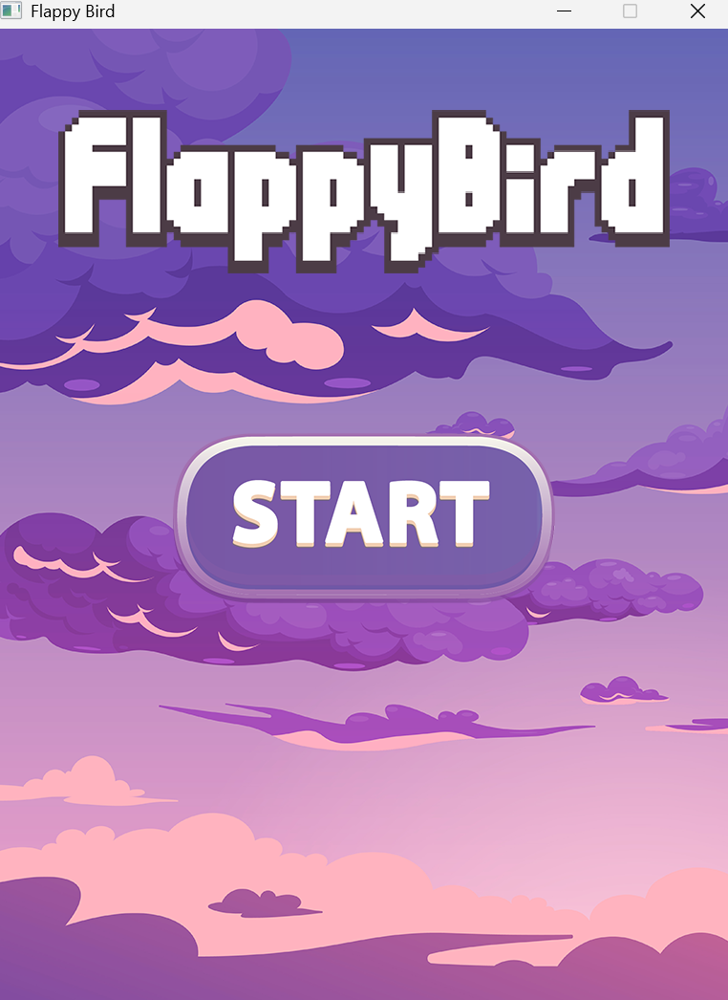
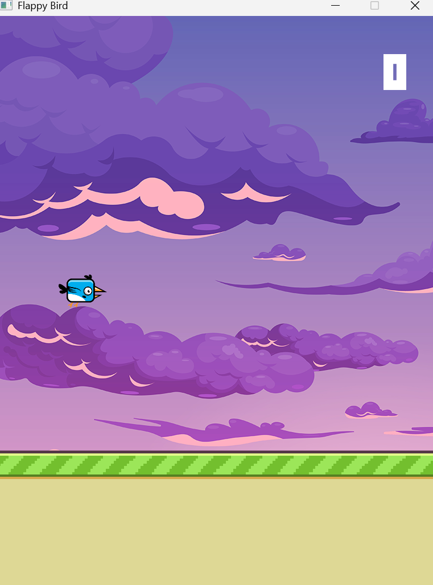

# Flappy Bird Clone 

A lightweight, high-performance clone of the famous **Flappy Bird** game. This project is built using **C++** and the **SFML (Simple and Fast Multimedia Library)**, focusing on clean game logic, collision detection, and a physics-based game loop.

---
## User Interface:
<table>
  <tr>
    <td></td>
    <td></td>
  </tr>
</table>
## Gameplay Features
* **Physics-Based Movement:** Smooth gravity and jumping mechanics.
* **Infinite Pipe Generation:** Procedurally generated obstacles with varying heights.
* **Real-time Scoring:** Track your progress as you pass through pipes.
* **Game State Management:** Includes a "Game Over" screen with an instant restart feature.
* **Lightweight Graphics:** Uses SFML's shape rendering for maximum compatibility.

---

##  Prerequisites

Before running this project, ensure you have the following installed:

1.  **C++ Compiler:** GCC/G++ (MinGW on Windows) or Clang.
2.  **SFML Library:** Version 2.5 or higher.
   
